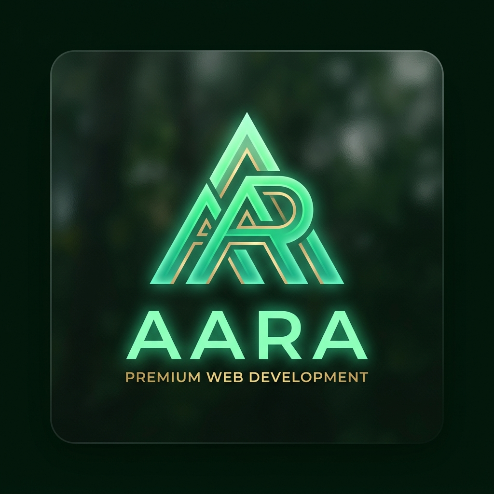

<p align="center">
  
</p>

<h1 align="center">DevPortfolio & Otaku Store</h1>

<p align="center">
  <strong>Solución Web de Portafolio Profesional e Integración de E-Commerce Premium</strong>
</p>

<p align="center">
  
  
  
  
  
  
</p>

---

## 🌟 Resumen del Proyecto

Este repositorio contiene el proyecto final para la graduación en **Desarrollo de Aplicaciones Web (DAW)**. Se compone de dos módulos principales completamente integrados:

1. **DevPortfolio**: Un portafolio profesional interactivo con diseño estético premium en color **verde bosque oscuro**, fondos con efectos *glassmorphic*, sistema interactivo de partículas en 2D y un panel de administración protegido para gestionar proyectos dinámicamente.
2. **Otaku Store** (Demo en: [otaku-store.es](https://otaku-store.es)): Una aplicación e-commerce integrada que funciona como proyecto destacado, la cual cuenta con inicio de sesión, carrito de compras dinámico y un completo sistema de roles (Invitado, Registrado y Administrador) que interactúan con una base de datos relacional MySQL.

---

## 🛠️ Arquitectura y Tecnologías

El proyecto sigue una separación limpia entre cliente y servidor (arquitectura desacoplada mediante API RESTful):

*   **Frontend (Cliente):** SPA (Single Page Application) modular construida con **React 18** y empaquetada con **Vite**. Las animaciones e interfaces se han desarrollado con **Vanilla CSS** nativo de alto rendimiento y **Font Awesome 6**.
*   **Backend (Servidor):** API RESTful desarrollada en **PHP 8.x nativo** que procesa las solicitudes y devuelve respuestas en formato estructurado JSON. Adicionalmente, utiliza la librería **FPDF** para generar catálogos de productos listos para imprimir.
*   **Base de Datos:** Motor relacional **MySQL** configurado específicamente con codificación de caracteres `utf8mb4` para la perfecta representación de tildes y caracteres especiales en español.

---

## 📦 Instalación y Configuración en Local

Sigue los siguientes pasos para ejecutar el entorno de desarrollo en tu máquina local:

### 1. Clonar el repositorio y mover a XAMPP
Clona el proyecto dentro de la carpeta raíz de documentos de tu servidor web local (ej. `C:\xampp\htdocs\Portfolio`):
```bash
git clone https://github.com/RotaruX/Portfolio.git
cd Portfolio
```

### 2. Iniciar Servidor Apache y MySQL
Abre el panel de control de **XAMPP** e inicia los módulos de **Apache** y **MySQL**.

### 3. Configurar e Importar la Base de Datos
Crea una base de datos llamada `portfolio_db` con codificación `utf8mb4_unicode_ci`. Luego, importa el script SQL ubicado en `database/portfolio.sql`.

> [!IMPORTANT]
> Para asegurar que los caracteres especiales en español (acentos, ñ, etc.) no se corrompan, te recomendamos importar la base de datos a través de la línea de comandos de MySQL especificando el charset:
> ```bash
> c:\xampp\mysql\bin\mysql.exe -u root portfolio_db --default-character-set=utf8mb4 < database/portfolio.sql
> ```

### 4. Verificar credenciales del Backend
Asegúrate de que las credenciales de conexión en [api/db.php](file:///c:/xampp/htdocs/Portfolio/api/db.php) coinciden con las de tu servidor local:
```php
$db_host = 'localhost';
$db_name = 'portfolio_db';
$db_user = 'root';
$db_pass = ''; // Por defecto vacía en XAMPP
$db_charset = 'utf8mb4';
```

### 5. Instalar dependencias e iniciar React
Abre la consola en la raíz del proyecto, instala los módulos de Node.js e inicia el servidor de desarrollo rápido provisto por Vite:
```bash
npm install
npm run dev
```
El frontend estará disponible por defecto en `http://localhost:5173`.

---

## 🛒 Otaku Store: Sistema de Roles y Permisos

El proyecto **Otaku Store** implementa un control de acceso granular según el rol del usuario conectado:

| Rol | Icono | Funcionalidades y Permisos | Comportamiento del Carrito |
| :--- | :---: | :--- | :--- |
| **Invitado** | <i class="fas fa-eye"></i> `👁️` | Navegar por el catálogo, buscar productos y filtrar por categorías. Ver detalles individuales de cada artículo. | **Deshabilitado:** Debe iniciar sesión para añadir productos o comprar. |
| **Usuario Registrado** | <i class="fas fa-user"></i> `👤` | Gestionar perfil personal, ver el historial de pedidos y compras realizadas. | **Permiso completo:** Añadir, quitar o modificar cantidades en el carrito y realizar checkout. |
| **Administrador** | <i class="fas fa-user-shield"></i> `🛡️` | Crear, editar y eliminar productos (CRUD). Gestión de cuentas de usuario. Panel de control interno. | **PDF de Productos:** Capacidad de exportar un listado completo del stock en PDF usando la librería FPDF. |

---

## 💼 Características de DevPortfolio

*   **Diseño Verde Bosque Premium:** Una interfaz oscura moderna con acentos verde esmeralda y menta fluorescente. Efectos de traslucidez y desenfoque de fondo (*backdrop-filter*) en tarjetas y menús flotantes.
*   **Fondo de Partículas Interactivas:** El Hero de bienvenida incluye una red de partículas enlazadas dinámicamente mediante Canvas 2D que interactúa con la posición del cursor.
*   **Gestión Segura del Administrador:** Login administrativo integrado en el Header con la opción de recordar credenciales (usuario y contraseña) a través del almacenamiento de `localStorage`. Permite gestionar las entradas de proyectos en la base de datos sin alterar el código fuente.

---

## 📁 Estructura del Repositorio

A continuación, se detalla la organización de los directorios clave del proyecto:

```text
├── api/                    # Endpoints del backend en PHP (API RESTful)
├── assets/                 # Recursos de imágenes y logotipo del proyecto
├── database/               # Scripts SQL (Esquema principal e inserciones)
├── docs/                   # Documentación técnica interactiva para GitHub Pages
├── src/                    # Código fuente de la interfaz en React
│   ├── components/         # Componentes modulares (Header, Layout, Modales)
│   ├── pages/              # Vistas de la SPA (Projects, Home, Admin, etc.)
│   ├── styles/             # Archivos CSS (Diseño visual y paleta de colores)
│   └── main.jsx            # Entrada de la aplicación React
├── index.html              # Plantilla HTML principal de la SPA
├── index.php               # Enrutador y punto de entrada para PHP en Apache
├── package.json            # Configuración de dependencias de Node.js
└── vite.config.js          # Configuración del compilador y bundle de Vite
```

---

## 🚀 Despliegue y Enlaces de Interés

*   **Sitio Web de Otaku Store:** [otaku-store.es](https://otaku-store.es)
*   **Documentación Técnica:** Puedes acceder de forma interactiva y visualizando las explicaciones detalladas abriendo localmente el archivo [docs/index.html](file:///c:/xampp/htdocs/Portfolio/docs/index.html) en tu navegador, o desplegándola directamente en tu repositorio mediante GitHub Pages.
